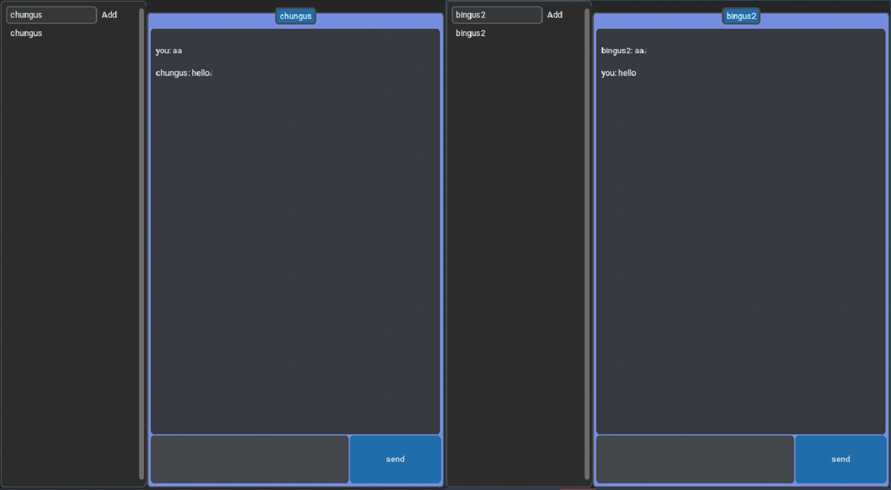

### Overview
a end to end encrytion chat room application built fully with python
### 1 Setup LDAP+ LAM : 
https://ubuntu.com/server/docs/service-ldap
https://www.youtube.com/watch?v=-kCaKjW-Vnk

### 2 Setup RABBIT_MQ:
https://www.youtube.com/watch?v=-kCaKjW-Vnk


### 3 Python dependencies: 

⦁	3.1 : python Openldap:
https://github.com/python-ldap/python-ldap
```bash
$ sudo apt-get install libsasl2-dev python-dev libldap2-dev libssl-dev
$ python setup.py build
$ python steup.py install
```
⦁	3.2 : python pika:
$pip install pika

⦁	3.3 python cryptography:
$pip install cryptography

⦁	3.4 python M2Crypto
 https://github.com/mcepl/M2Crypto/blob/master/INSTALL.rst#pre-requisites
$ python setup.py build
$ python steup.py install


⦁	3.5 customtkinter : 
$ pip install customtkinter

